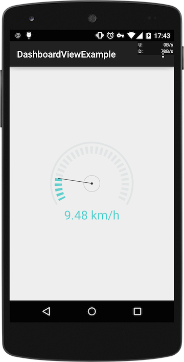

#DashBoardView 1.0.0

----------------------------------------------------------
####DashBoardView  是我的一个项目需要然后自己写的一个 view ，很简单 分享出来，如果大家有需要希望能满足你们的需要

----------------------------------------------------------

##Screenshot



### DashBoard.NOMAL


### DashBoard.RING 


----------------------------------------------------------

### Use

       compile 'com.github.sdaduanbilei:dashboard-view:1.0.0@aar'

或者下载library


##XML_layout
```
		<cn.sdaduanbilei.library.DashboardView
        android:layout_width="@dimen/dash_size"
        android:layout_height="@dimen/dash_size"
        app:dashTitle="DashBoard"
        app:dashProMax="100"
        app:dashProgress="40"
        app:dashProColor="@color/downy"
        app:dashColor="@color/white_dash"
        app:dashProWidth="16dp"
        android:layout_centerInParent="true"
        app:dashWidth="4dp"
        app:dashIcon="@drawable/ic_bike"
        />
```
##CODE
``` 
     mDashoardView.setDashProgress(20);//设置进度
     mDashoardView.setDashTitle("0 km/h"); // 设置dashview 的title
     mDashoardView.setDashTitleColor(getResources().getColor(R.color.downy)); // title 颜色
     mDashoardView.setDashTitleSize(12); title 大小
     mDashoardView.setDasProColor(getResources().getColor(R.color.downy));// 设置进度条的宽度
     mDashoardView.setDashProWidth(16); 设置进度条的宽度
     mDashoardView.setDashColor(getResources().getColor(R.color.white_dash));// 设置底部圆环颜色
     mDashoardView.setDashWidth(8);    设置底部圆环的宽度
     mDashoardView.setDashIcon(R.drawable.ic_bike); // 设置dashboard中间的图标
     mDashoardView.setDashProMax(100);//设置dashboard 的最大值
     mDashoardView.setDashStyle(DashBoard.NOMAL);// 设置主题
```
##Version 

 1.0.0
  
##About Me

一个小小程序员  kunming

##License
	Copyright 2014 sdaduanbilei

	Licensed under the Apache License, Version 2.0 (the "License");
	you may not use this file except in compliance with the License.
	You may obtain a copy of the License at

		 http://www.apache.org/licenses/LICENSE-2.0

	Unless required by applicable law or agreed to in writing, software
	distributed under the License is distributed on an "AS IS" BASIS,
	WITHOUT WARRANTIES OR CONDITIONS OF ANY KIND, either express or implied.
	See the License for the specific language governing permissions and
	limitations under the License.	
 


